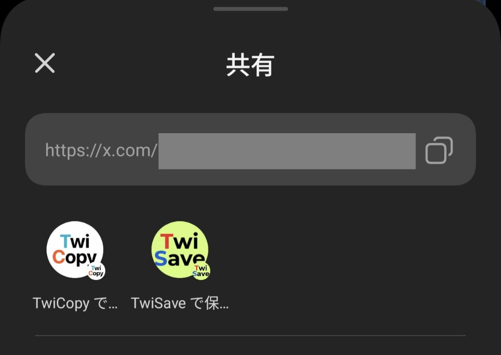
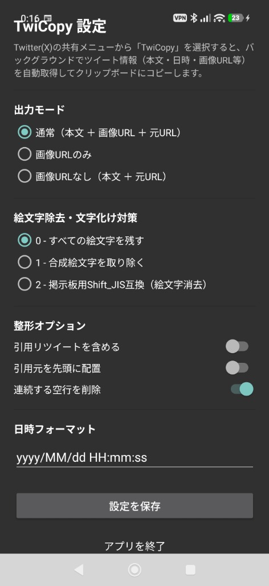

# TwiCopy 📱

Twitter(X)の「共有」メニューから、ツイートの本文・投稿日時・画像URL（`.jpg` 直接リンク）などを高速取得し、自動でクリップボードにコピーする超軽量Androidアプリです。

掲示板（5ちゃんねる等）やメッセージアプリへのコピペ整形に最適化されています。

<div align="center">

[-2ea44f?style=for-the-badge&logo=android&logoColor=white)](./TwiCopy.apk)
[](../../releases)

</div>

---

## 📥 ダウンロード (Download)

以下のボタンから最新版のアプリを直接ダウンロードできます。

<div align="center">

### 👉 [【 ⬇️ TwiCopy.apk (最新版 v1.1.4) を直接ダウンロード 】](./TwiCopy.apk) 👈

</div>

---

## 📸 スクリーンショット

<div align="center">
  <table>
    <tr>
      <th align="center"><b>共有メニュー（ワンタップ実行）</b></th>
      <th align="center"><b>設定画面（通常起動時）</b></th>
    </tr>
    <tr>
      <td align="center" valign="top">
        
        <br />
        <sub>Twitter(X)の共有シートからワンタップで即座にコピー</sub>
      </td>
      <td align="center" valign="top">
        
        <br />
        <sub>出力モードや絵文字フィルタ・引用設定をカスタマイズ</sub>
      </td>
    </tr>
  </table>
</div>

---

## ✨ 主な特徴

- 🚀 **共有メニューからワンタップ実行**:
  Twitter(X)の共有シートから「TwiCopy」を選ぶだけで、バックグラウンドで自動取得＆クリップボードコピー＆トースト通知（画面遷移なしで即終了）。
- 🖼️ **直接画像URL（`.jpg` / `.png`）の展開**:
  ツイートに添付された画像（複数枚対応）を直接開ける画像形式のURLに変換して出力。
- ⚙️ **カスタマイズ可能な整形フォーマット**:
  - **出力モード**: 通常（本文＋画像URL＋元URL） / 画像URLのみ / 画像URLなし
  - **絵文字・文字化け対策**: 0: 残す / 1: 合成絵文字削除 / 2: 掲示板用Shift_JIS互換（絵文字消去）
  - **引用リツイート**: 含める / 含めない（デフォルト: 含めない）
  - **空行削除**: 連続する空行を自動圧縮
  - **日時フォーマット**: `yyyy/MM/dd HH:mm:ss` 等
- 🪶 **超軽量設計（約1.2MB）**:
  重い外部ライブラリを排除し、Android標準コンポーネントのみで構築。
- 🔒 **プライバシー・セキュリティ**:
  個人サーバーやサードパーティのWebサイトを経由せず、アプリ単体でエンドポイントと直接通信して端末内でローカル整形。個人情報や履歴の収集は一切ありません。

---

## 📋 出力フォーマット例

### 通常（画像2枚付き）
```text
ユーザー名 [@ユーザーID] (2026/09/09 22:30:00)
ツイート本文がここに入ります。
https://pbs.twimg.com/media/image1.jpg
https://pbs.twimg.com/media/image2.jpg
https://x.com/user/status/1234567890
```

### 引用リツイートを含める場合（設定でON）
```text
ユーザー名 [@ユーザーID] (2026/09/09 22:30:00)
ツイート本文

[引用元] 引用先ユーザー名 [@引用先ID] (2026/09/09 21:00:00)
引用先ツイート本文
https://pbs.twimg.com/media/quote_img.jpg
https://x.com/quoted/status/987654321

https://x.com/user/status/1234567890
```

---

## 📲 インストール & 初期設定

1. 上の **[ダウンロードボタン](./TwiCopy.apk)** または [Releases](../../releases) ページから `TwiCopy.apk` をダウンロードします。
2. Android端末でダウンロードしたAPKファイルを開いてインストールします。
3. インストール後、**一度ホーム画面から「TwiCopy」を開いて「設定を保存」または「アプリを終了」を押してください**（※OSのダイレクト共有ショートカットが自動登録されます）。

---

## 📖 使い方

1. Twitter(X)公式アプリまたはブラウザで、コピーしたいツイートの **「共有」** ボタンを押します。
2. 共有先一覧から **「TwiCopy」** をタップします。
3. トースト通知（「TwiCopy: コピーしました！」）が表示され、クリップボードに整形済みテキストが保存されます。
4. あとは掲示板やメモ帳、チャット等に貼り付けるだけです！

---

## 🛠️ ビルド手順

### 必要な環境
- JDK 17
- Android SDK (API Level 35)

### ビルドコマンド

```bash
# クローン
git clone https://github.com/your-username/TwiCopy.git
cd TwiCopy

# デバッグAPKのビルド (TwiCopy.apk が生成されます)
./gradlew assembleDebug

# リリースAPKのビルド
./gradlew assembleRelease
```

---

## 🏷️ バージョン管理規則

本プロジェクトのバージョンはセマンティックバージョニング形式（`v1.1.x`）を採用しています。

- **現在のバージョン**: `v1.1.4` (`versionCode = 114`, `versionName = "1.1.4"`)
- **アップデート時**: 小さな変更や修正があるたびに末尾のパッチ番号を +1 ずつインクリメントします（例: `v1.1.4` → `v1.1.5` → `v1.1.6` ...）。

---

## 📄 ライセンス

このプロジェクトは [MIT License](LICENSE) の下で公開されています。
